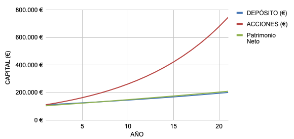

## Introducción

La diversificación de inversiones es una estrategia clave para mitigar riesgos y maximizar rendimientos. En este artículo, exploraremos una simulación de inversión en tres principales clases de activos:
1. renta fija: estable y previsible, se basa en "prestar" dinero a entidades que te devolverán con una rentabilidad fija acordada desde el inicio. Por ejemplo, depósitos bancarios, deuda pública...
2. renta variable: mayores rendimientos a cambio de mayor volatilidad. El claro ejemplo son las acciones o las criptomonedas. Sin embargo, existen activos financieros como los fondos indexados que han demostrado ser estables y muy rentables a largo plazo.
3. inmuebles: estable, aunque requiere un mantenimiento y gestión más activa que los anteriores. La rentabilidad se obtiene de rentas o apreciación del inmueble.
 
En este artículo analizaremos cómo se comporta cada una de estas inversiones mediante una simulación.

## ¿Qué es el apalancamiento?

El apalancamiento es una estrategia financiera que usa dinero prestado para aumentar la capacidad de inversión. Esto permite a los inversores comprar más activos de lo que podrían con su propio dinero. Aunque puede aumentar las ganancias, también incrementa el riesgo, ya que las pérdidas pueden ser mayores. Es una herramienta que debe usarse con cuidado para evitar grandes pérdidas.

En el caso de un bien inmueble se hablaría de hipoteca. Comprar un piso mediante hipoteca y alquilarlo supone que ésta se pagaría con los ingresos por rentas. No queda libre de riesgos ya que podrían suceder impagos o gastos inesperados, como derramas, impuestos, mantenimiento, etécetera.

## ¿Qué es el interés compuesto?

El interés compuesto es cuando ganas interés no solo sobre el dinero que invertiste inicialmente, sino también sobre los intereses que has ganado. Esto significa que tu dinero puede crecer más rápido con el tiempo. Cuanto más tiempo dejes tu dinero invertido, más crecerá, porque cada vez ganas interés sobre una cantidad mayor. Es una forma muy efectiva de hacer que tus ahorros crezcan a largo plazo.

Se verá más claro en la simulación.

## Simulación

Se parte de las siguientes condiciones:
- Rentabilidad de depósito bancario del 3%: valor nada descabellado a fecha de mediados de 2024.
- Rentabilidad de fondo indexado del 10%: por debajo de la que ha conseguido el S&P500 en los últimos 30 años.
- Rentabilidad neta aproximada de un 5% para la inversión en inmuebles. Ésta puede variar mucho entre ciudades y países, así que se deja la [hoja de cálculo](https://docs.google.com/spreadsheets/d/17YJElTRFaT8tzRWqTMXgR6-sYNsoyqIsEg67C_N19AQ/edit?usp=sharing) pública para que cualquiera pueda simular su situación.

### Inversión con hipoteca

Tanto en el fondo indexado como en el depósito se invierten 41.000€, dinero necesario para la entrada y otros gastos utilizados en la compra del inmueble.

Gracias a la mayor rentabilidad del fondo indexado se puede ver que el interés compuesto hace crecer el valor de las acciones de forma exponencial. Es por esto que sería la opción más rentable, pero habría que valorar su volatilidad.

Por otro lado, el depósito es más rentable a corto plazo, pero a largo el efecto del apalancamiento en la inversión inmobiliaria lo supera con creces.

|                | Rentabilidad total | Rentabilidad anualizada | Valor total |
| -------------- | ------------------ | ----------------------- | ----------- |
| Deposito       | 86 %               | 4,10%                   | 76.272 €    |
| Fondo indexado | 511 %              | 24,33%                  | 250.461 €   |
| Inmuebles      | 242 %              | 11,51%                  | 140.114 €   |

### Inversión sin hipoteca

En este caso en el depósito y el fondo indexado se invierten los 110.000€ correspondientes a la compra del piso.

Se aprecia que dado que la rentabilidad neta del inmueble es similar a la del depósito, el patrimonio neto acumulado crece de forma similar. En comparación con la inversión con hipoteca, la curva de crecimiento es mucho menor.

|                | Rentabilidad total | Rentabilidad anualizada | Valor total |
| -------------- | ------------------ | ----------------------- | ----------- |
| Deposito       | 86 %               | 4,10%                   | 206.493 €   |
| Fondo indexado | 511%               | 24,33%                  | 678.078 €   |
| Inmuebles      | 88 %               | 4,20%                   | 208.913 €   |

Obviamente, en el caso del depósito y el fondo indexado la rentabilidad total y anualizada son las mismas ya que la única condición que ha cambiado es la inversión inicial. Sin embargo, en el caso del piso la rentabilidad anual ha disminuido de un 11,51% a un 4,20%.

## Conclusiones

Queda claro que la inversión con apalancamiento es mucho más rentable que sin apalancamiento. Además, para acceder a la compra de un inmueble sin hipoteca se necesitan muchos más ahorros. Por otro lado, si el mercado continúa como ha venido haciendo las últimas décadas, la inversión en fondos indexados podría ser mucho más rentable.

Siempre queda la opción de diversificar y combinar estos tres tipos de inversiones, incluso con otras como las carteras de ahorro. De esta forma se podría promediar la rentabilidad y compensar volatilidades.
