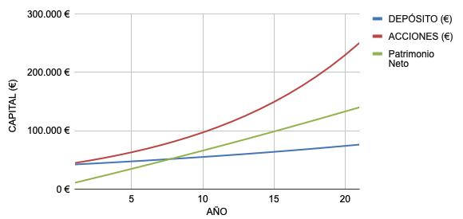
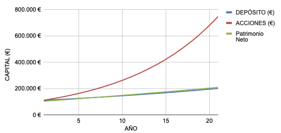

## Introduction

Investment diversification is a key strategy for mitigating risks and maximizing returns. In this article, we will explore an investment simulation across three main asset classes:
1. Fixed income: stable and predictable, based on "lending" money to entities that will return it with a fixed agreed-upon return. Examples include bank deposits, government bonds...
2. Equities: higher returns in exchange for greater volatility. Clear examples are stocks or cryptocurrencies. However, there are financial assets like index funds that have proven to be stable and highly profitable in the long term.
3. Real estate: stable, although it requires more active maintenance and management than the previous ones. Profitability is obtained from rents or property appreciation.

In this article, we will analyze how each of these investments behaves through a simulation.

## What is leverage?

Leverage is a financial strategy that uses borrowed money to increase investment capacity. This allows investors to buy more assets than they could with their own money. While it can increase profits, it also increases risk, as losses can be greater. It is a tool that should be used with care to avoid significant losses.

In the case of real estate, we are talking about a mortgage. Buying an apartment with a mortgage and renting it out means that the mortgage would be paid with rental income. It is not without risks as there could be defaults or unexpected expenses, such as special assessments, taxes, maintenance, etc.

## What is compound interest?

Compound interest is when you earn interest not only on the money you initially invested but also on the interest you have already earned. This means your money can grow faster over time. The longer you leave your money invested, the more it grows, because you are earning interest on an increasingly larger amount. It is a very effective way to make your savings grow in the long term.

This will become clearer in the simulation.

## Simulation

The following conditions are assumed:
- Bank deposit return of 3%: a reasonable value as of mid-2024.
- Index fund return of 10%: below what the S&P500 has achieved in the last 30 years.
- Approximate net return of 5% for real estate investment. This can vary greatly between cities and countries, so the [spreadsheet](https://docs.google.com/spreadsheets/d/17YJElTRFaT8tzRWqTMXgR6-sYNsoyqIsEg67C_N19AQ/edit?usp=sharing) is made public for anyone to simulate their situation.

### Investment with mortgage

In both the index fund and the deposit, €41,000 is invested, the amount needed for the down payment and other expenses associated with purchasing the property.

Thanks to the higher return of the index fund, you can see that compound interest causes the value of the shares to grow exponentially. This is why it would be the most profitable option, but its volatility must be considered.

On the other hand, the deposit is more profitable in the short term, but in the long term, the effect of leverage in real estate investment surpasses it by far.

|             | Total return | Annualized return | Total value |
| ----------- | ------------ | ----------------- | ----------- |
| Deposit     | 86%          | 4.10%             | €76,272     |
| Index fund  | 511%         | 24.33%            | €250,461    |
| Real estate | 242%         | 11.51%            | €140,114    |

### Investment without mortgage

In this case, €110,000, equivalent to the property purchase price, is invested in both the deposit and the index fund.

It can be seen that since the net return of the property is similar to that of the deposit, the accumulated net worth grows similarly. Compared to the investment with a mortgage, the growth curve is much smaller.

|             | Total return | Annualized return | Total value |
| ----------- | ------------ | ----------------- | ----------- |
| Deposit     | 86%          | 4.10%             | €206,493    |
| Index fund  | 511%         | 24.33%            | €678,078    |
| Real estate | 88%          | 4.20%             | €208,913    |

Obviously, in the case of the deposit and the index fund, the total and annualized returns are the same since the only condition that has changed is the initial investment. However, in the case of the property, the annual return has decreased from 11.51% to 4.20%.

## Conclusions

It is clear that investment with leverage is much more profitable than without leverage. Additionally, to purchase a property without a mortgage, much more savings are needed. On the other hand, if the market continues as it has in recent decades, investment in index funds could be much more profitable.

There is always the option to diversify and combine these three types of investments, even with others like savings portfolios. This way, returns can be averaged, and volatilities can be compensated.