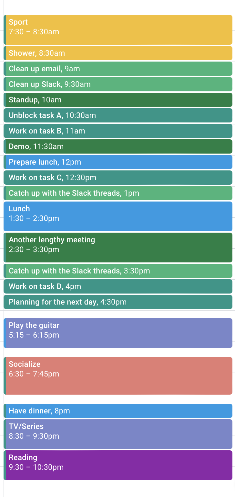

---

title: "Time blocking"
date: 2023-11-15
draft: false
summary: "Usando la estrategia de time blocking para asegurarte de que haces las cosas"
tags: ["productividad"]
showAuthor: false
series: ["Productividad"]
series_order: 1
seriesOpened: true
---

## Introducción

¿Alguna vez has sentido que no has hecho nada en todo el día? ¿Qué has estado haciendo toda la mañana? Si estas preguntas te suenan familiares, no estás solo. En esta publicación, exploraremos la poderosa estrategia del time blocking para ayudarte a aprovechar al máximo tu día.

## Llamada a la acción

Te sugiero que hagas un experimento por un día. Si eso te parece demasiado, puede ser durante el transcurso de una mañana o una tarde.

### 1. Reúne evidencia

Actúa como lo haces normalmente y sé consciente de en qué gastas tu tiempo. Puedes usar diferentes herramientas para esto:

- Papel y lápiz, una agenda o una pizarra
- Una hoja de cálculo
- [Toggl](https://toggl.com): una buena extensión del navegador y aplicación para rastrear el tiempo que dedicas a diferentes tareas. Se usa con frecuencia en consultoría y freelancing donde tienes que tratar con diferentes clientes.

Todos estos métodos funcionaron para mí, pero puede haber otros. Trata de no dejar ningún espacio en blanco. El objetivo es darte cuenta de las áreas en las que gastas tiempo y cuánto espacio les dedicas. Supongamos que durante un solo día el resultado es:

| Área                          | Tiempo (horas) |
| ----------------------------- | -------------- |
| Trabajo real                  | 2              |
| Reuniones                     | 3              |
| Slack                         | 3              |
| Limpieza de email             | 0.5            |
| Lectura                       | 0.5            |
| Cocinar                       | 1              |
| Limpieza del hogar            | 0.5            |
| Desplazamiento en el teléfono | 1.5            |
| TV/Series                     | 1              |
| Almuerzo                      | 1.5            |
| Deporte                       | 1.5            |
| Dormir                        | 8              |

En este punto, ya tienes algunos datos sobre los que puedes decidir: ¿estás gastando demasiado tiempo en cosas no productivas? ¿Puedes optimizar el tiempo que dedicas a las reuniones? Tal vez deberías rechazar aquellas en las que no participas mucho.

### 2. Establece tus objetivos diarios

Decide la cantidad de tiempo que quieres dedicar a cada área. Supongamos que quieres hacer 4 horas de trabajo real. Entonces necesitas reducir el tiempo que pasas en Slack, reuniones o limpiando el email. O tal vez quieras reservar un tiempo extra para leer.

### 3. Planifica el día siguiente

Ahora toma tus números y planifica el día siguiente con las cosas que quieres hacer. Dedica un bloque de tiempo para cada área o divídelo por tareas. Por ejemplo:

Si esto te parece demasiado detallado, reduce el número de bloques de tiempo. Es importante usar un color diferente para cada área para que sea fácil rastrear cuánto tiempo dedicas a cada cosa.

Es muy importante planificar solo las cosas que no están bloqueadas. De lo contrario, necesitarías reorganizar los bloques de tiempo (lo cual no es un gran problema, pero deberías evitarlo).

### 4. Beneficios

1. El primer beneficio que notarás es que dejarás de procrastinar. ¿Has oído hablar de [la ley de Parkinson](https://www.atlassian.com/blog/productivity/what-is-parkinsons-law)?

> El trabajo se expande para llenar el tiempo disponible para su finalización.

Al limitar el tiempo para cada tarea, evitarás gastar demasiado tiempo en ella.

2. Esto también reducirá la sensación de improductividad, ya que, al final del día, te darás cuenta de todas las cosas que lograste.
3. También te permitirá centrarte en lo que aporta valor minimizando el desplazamiento casual, el tiempo excesivo en discusiones de Slack o las reuniones prolongadas.

## Conclusiones

Incorporar el time blocking en tu rutina puede transformar la forma en que gestionas tu tiempo. Prueba esta estrategia y comparte tus experiencias conmigo en [ LinkedIn](https://linkedin.com/in/juands0).

¡Mantente atento a más consejos de productividad en esta serie en curso!