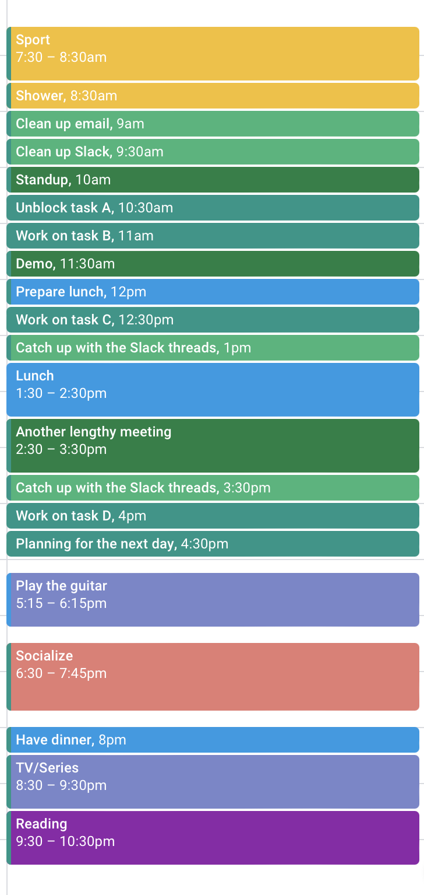

## Introduction

Have you ever felt like you hadn't done anything throughout the day? What have you been doing all morning? If these questions sound familiar, you're not alone. In this post, we'll explore the powerful strategy of time blocking to help you make the most of your day.

## Call to action

I suggest you do an experiment for a day. If that seems like too much, it can be over the course of a morning or afternoon.

### 1. Gather evidence

Just act as you normally do and be aware of what you spend your time on. You can use different tools for this:

- Paper and pencil, an agenda or a whiteboard
- A spreadsheet
- [Toggl](https://toggl.com): a nice browser extension and app to track the time you spend on different tasks. Used quite frequently in consulting and freelancing where you have to deal with different clients.

All these worked for me, but there may be others. Try not to leave any blank space. The goal is to realize the areas you spend time on and how much space you dedicate to them. Let's say that over a single day the result is:

| Area            | Time (hours) |
| --------------- | ------------ |
| Actual Work     | 2            |
| Meetings        | 3            |
| Slack           | 3            |
| Email cleaning  | 0.5          |
| Reading         | 0.5          |
| Cooking         | 1            |
| Home cleaning   | 0.5          |
| Phone scrolling | 1.5          |
| TV/Series       | 1            |
| Lunch           | 1.5          |
| Sport           | 1.5          |
| Sleep           | 8            |

At this point you already have some data you can decide on: are you spending too much time with non-productive stuff? Can you optimize the time you spend in meetings? Maybe you should be declining the ones you are not participating much in.

### 2. Set your daily goals

Decide the amount of time you want to dedicate to each area. Let's say that you want to do 4 hours of actual working. Then you need to reduce the time you spend in Slack, meetings or cleaning the email. Or maybe you want to book some extra time for reading.

### 3. Plan the next day

Now get your numbers and plan the next day with the things you want to do. Dedicate one time block for each area or split it by tasks. For example:

If this sounds too granular, reduce the number of time blocks. It's important to use a different color for each area so that it's easy to track how much time you spend on each thing.

It's very important to plan just the things that are not blocked. Otherwise, you would need to reshuffle the time blocks (which is not a big deal, but you should avoid it).

### 4. Benefit

1. The first benefit you will sense is that you will stop procrastinating. Ever heard of [Parkinson's law](https://www.atlassian.com/blog/productivity/what-is-parkinsons-law)? 

> Work expands to fill the time available for its completion.

By limiting the time for each task, you'll avoid overspending time on it.

2. This will also reduce the feeling of unproductivity as, by the end of the day, you will realize all the things you accomplished.
3. It also let you focus on what brings value by minimizing casual scrolling, excessive time in Slack discussions, or prolonged meetings.

## Conclusions

Incorporating time blocking into your routine can transform the way you manage your time. Try out this strategy and share your experiences with me on [ LinkedIn](https://linkedin.com/in/juands0).

Stay tuned for more productivity tips in this ongoing series!
