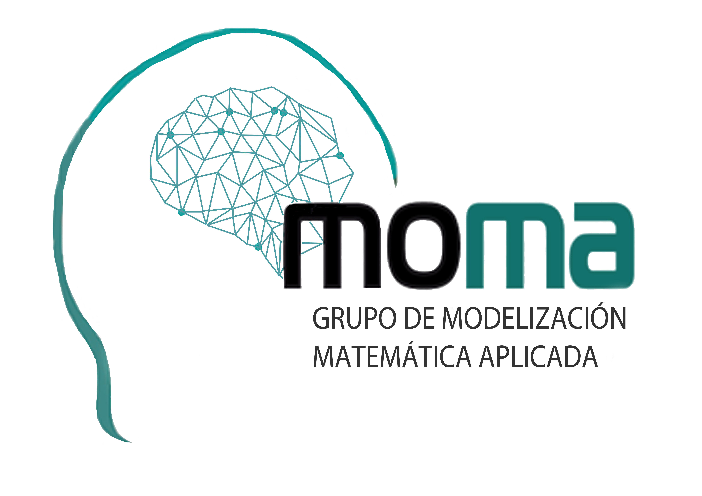
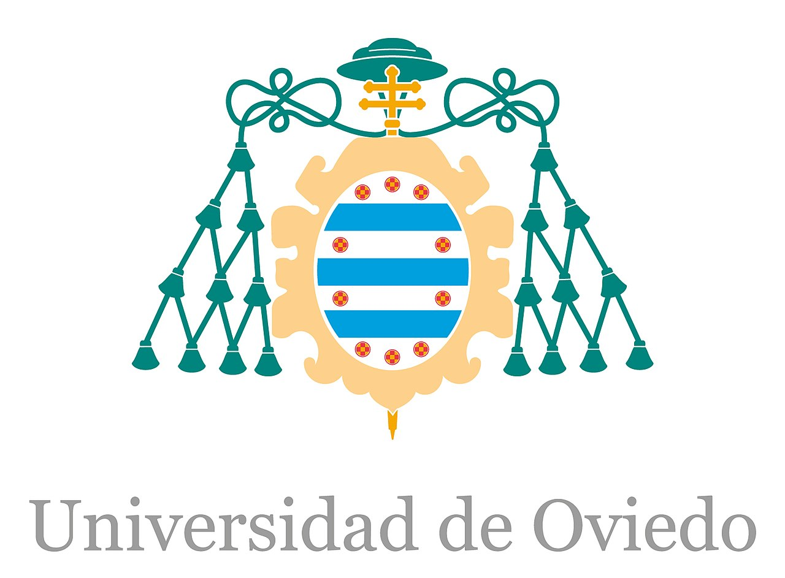

## Experience

<table>
    <thead>
        <tr>
            <th>Company</th>
            <th>Link</th>
            <th>Role</th>
            <th>Dates</th>
            <th>Location</th>
        </tr>
    </thead>
    <tbody>
        <tr>
            <td rowspan=3></td>
            <td rowspan=3><a href="https://www.redhat.com/" target="_blank">Red Hat</a></td>
        </tr>
        <tr>
            <td>Senior Software Engineer</td>
            <td>2023 - Present</td>
            <td>Full Remote</td>
        </tr>
         <tr>
            <td>Software Engineer</td>
            <td>2021 - 2023</td>
            <td>Full Remote</td>
        </tr>
        <tr>
            <td></td>
            <td><a href="https://www.merkle.com/" target="_blank">Merkle</a></td>
            <td>Cloud Engineer</td>
            <td>2021</td>
            <td>Hybrid  (Spain)</td>
        </tr>
        <tr>
            <td rowspan=3></td>
            <td rowspan=3><a href="https://www.alisys.net/" target="_blank">Alisys</a></td>
        </tr>
        <tr>
            <td>Robotics & AI Team Leader</td>
            <td>2020 - 2021</td>
            <td>Hybrid  (Spain)</td>
        </tr>
         <tr>
            <td>R&D Engineer</td>
            <td>2019 - 2020</td>
            <td>Office based (Spain)</td>
        </tr>
        <tr>
            <td></td>
            <td><a href="https://moma.grupos.uniovi.es" target="_blank">Moma</a></td>
            <td>Internship</td>
            <td>2019</td>
            <td>Office based (Spain)</td>
        </tr>
    </tbody>
</table>

---

## Research

<table>
    <thead>
        <tr>
            <th>Title</th>
            <th>Link</th>
            <th>Date</th>
        </tr>
    </thead>
    <tbody>
        <tr>
            <td>Compensating atmospheric turbulence with CNNs for defocused pupil image wavefront sensors</td>
            <td><a href="https://doi.org/10.1093/jigpal/jzaa045" target="_blank">10.1093/jigpal/jzaa045</a></td>
            <td>2020</td>
    </tbody>
    <tbody>
        <tr>
            <td>Study of the feasibility of newer neural networks in Adaptive Optics</td>
            <td><a href="https://www.google.com/url?sa=t&rct=j&q=&esrc=s&source=web&cd=&ved=2ahUKEwjdtsKOorSCAxV3EFkFHRwFBhMQFnoECBgQAQ&url=https%3A%2F%2Fciencias.uniovi.es%2Fc%2Fdocument_library%2Fget_file%3Fuuid%3Dae662ecb-3fd0-4705-9338-fd8bc0f31a3e%26groupId%3D895010&usg=AOvVaw2Fgo1a1QjAUrhkXuwgLm-R&opi=89978449" target="_blank">Download</a></td>
            <td>2019</td>
    </tbody>
</table>

---

## Education

<table>
    <thead>
        <tr>
            <th>School</th>
            <th>Link</th>
            <th>Degree</th>
            <th>Date</th>
        </tr>
    </thead>
    <tbody>
        <tr>
            <td></td>
            <td><a href="https://www.uned.es/" target="_blank">UNED</a></td>
            <td>Master's degree in Big Data</td>
            <td>2019-2021</td>
    </tbody>
    <tbody>
        <tr>
            <td></td>
            <td><a href="https://www.uniovi.es" target="_blank">University of Oviedo</a></td>
            <td>Physics degree: AI for applied Physics specialization</td>
            <td>2015-2019</td>
    </tbody>
</table>